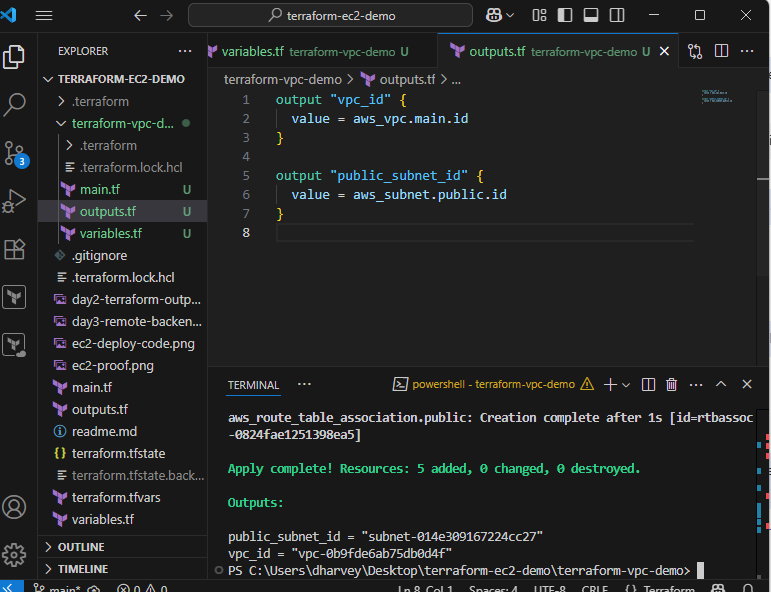

# Terraform EC2 Demo – Day 1

## Overview

This project demonstrates the basics of using Terraform to provision an AWS EC2 instance. It covers:

- Writing Terraform configuration (`main.tf`)
- Using the AWS provider
- Deploying an Amazon Linux 2 EC2 instance (`t2.micro`)
- Running basic Terraform commands: `init`, `plan`, `apply`, and `destroy`

---

## Prerequisites

- AWS account with access keys configured via AWS CLI (`aws configure`)
- Terraform CLI installed ([Download here](https://developer.hashicorp.com/terraform/downloads))
- Basic familiarity with AWS EC2

---

## Getting Started

1. Clone the repository or create a new folder:
   ```bash
   mkdir terraform-ec2-demo && cd terraform-ec2-demo

2. provider "aws" {
  region = "us-east-1"
}

resource "aws_instance" "example" {
  ami           = "ami-0c02fb55956c7d316"
  instance_type = "t2.micro"

  tags = {
    Name = "Day1-TerraformEC2"
  }
}
3. Initialize Terraform
    terraform init

4. Preview Changes
    terraform plan

5. Apply the configuration to create the EC2
    terraform apply

6. Verify EC2 is running in AWS Console

7. Clean up Resources to avoid charges
    terraform destroy / yes 


Key Terraform Commands
terraform init – Initializes the working directory and downloads provider plugins.

terraform plan – Shows the changes Terraform will make.

terraform apply – Executes the plan and creates resources.

terraform destroy – Deletes all resources managed by Terraform.

What I Learned
Basics of Terraform workflow and configuration.

How to provision AWS resources with Terraform.

Importance of AWS region matching between Terraform and AWS Console.

Terraform lifecycle commands.


## Day 2: Refactor with Variables & Outputs

In Day 2, I improved the Terraform configuration by:
- Refactoring the EC2 config to use `variables.tf`
- Creating `outputs.tf` to expose instance_id and public_ip
- Applying the updated plan successfully

### 📸 Screenshot


## Day 3: Remote Backend with S3 + DynamoDB

Configured a remote backend to store Terraform state files in S3 and use DynamoDB for state locking.

### Screenshot


# Day 4 – Custom VPC with Terraform

Today I created a production-ready VPC from scratch using Terraform.  
The VPC includes:
- A public subnet
- An Internet Gateway
- A Route Table with association
- Outputs for `vpc_id` and `subnet_id`

## Screenshot



## Day 5 – GitHub Actions CI for Terraform

Set up a continuous integration (CI) workflow using GitHub Actions to automatically run `terraform init` and `terraform plan` whenever changes are pushed to the repository.

- Validates syntax and ensures Terraform plans succeed before deployment.
- Helps enforce infrastructure as code quality in a CI/CD pipeline.

📸 Screenshot:

